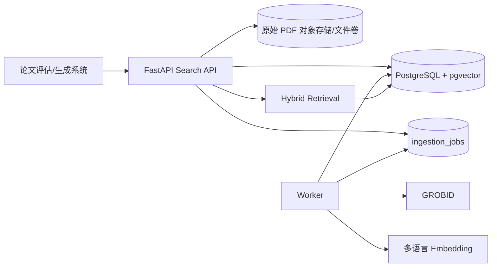

# OmniScope 设计说明

## 1. 当前项目评估

当前项目可以用于小规模演示和功能验证，但不建议直接支撑大型论文库正式检索：

| 维度 | 当前实现 | 风险 | 改进版 |
| --- | --- | --- | --- |
| 向量存储 | `embedding_json` 文本列 | 无 ANN，检索为全量 Python 扫描 | PostgreSQL `vector` + HNSW |
| 词法信号 | 主要依赖 dense embedding/外部 PaperQA 兜底 | 专有名词、DOI、学科缩写易漏召回 | GIN `tsvector` + 中文分词 + RRF |
| 语言覆盖 | 默认 `BAAI/bge-small-en-v1.5` | 中文学位论文与英文查询不匹配 | 默认 BGE-M3，多语言统一空间 |
| 导入链路 | API 内同步解析、嵌入和关系重建 | 超时、重复执行、并发不可控 | job 表 + worker + 可重试状态机 |
| 数据库演进 | `create_all` 和手写增量 DDL | 难以审计、回滚与灰度发布 | 版本化 SQL migration |
| 文档结构 | `pypdf`/正则为主，GROBID 部分旁路 | 双栏、表格、参考文献结构容易丢失 | GROBID TEI 优先，纯文本降级 |
| 证据链 | 只返回简单 snippet | 不利于论文评估和生成引用 | 页码、章节路径、版本、哈希完整返回 |

## 2. 总体架构

生产环境建议把本地文件卷替换为 S3/MinIO 兼容对象存储；本目录默认使用挂载卷，便于单机部署和离线验收。

## 3. 数据与幂等

- `documents` 是逻辑论文；`document_versions` 用 SHA-256 识别内容版本。
- `chunks` 是检索单元，带 `section_path`、页码、字符区间和 `content_hash`。
- `ingestion_jobs` 使用 `queued/running/succeeded/failed` 状态、`attempts` 和 `locked_at`，worker 通过 `FOR UPDATE SKIP LOCKED` 领取任务。
- 同一 `document_version_id + chunk_no` 唯一；重复上传不会创建重复分块。
- embedding 以 `embedding_model` 版本隔离。换模型时只需新增索引批次，不会污染旧向量。

## 4. 检索流程

1. 查询规范化：保留原查询，同时对中文做可选 jieba 分词，对英文做大小写和空白归一化。
2. Dense 召回：pgvector 对 `chunks.embedding` 使用 cosine HNSW，召回 `dense_k`。
3. Lexical 召回：`chunks.search_vector @@ websearch_to_tsquery('simple', ...)`，GIN 索引加速，召回 `lexical_k`。
4. 融合：按 `1 / (rrf_k + rank)` 对两个列表做加权 RRF；论文级去重时保留最高分 chunk，同时可以设置每篇论文上限。
5. 可选重排：生产上可将前 50~100 个候选交给本地 cross-encoder/reranker；改进版保留接口，但默认不开启，避免在 API 进程中加载第二个大模型。
6. 证据返回：返回论文标题、作者、版本、页码、章节、片段和分数，禁止只返回不可定位的摘要文本。

## 5. 质量策略

- 结构优先：GROBID 成功时按 TEI 章节切分；失败时按页/段落降级。
- 语义与词法并行：dense 负责同义改写与跨语言，lexical 负责 DOI、方法名、模型名、数据集名和中文专名。
- 领域自适应：先用 BGE-M3 或等效多语言模型；积累点击/人工相关性标注后再训练或蒸馏 reranker。
- 版本化评测：每次改 embedding、切分、RRF 权重或过滤逻辑都重新跑 Recall@K、MRR@K、nDCG@K 和延迟分位数。
- 可观测性：至少记录 job 延迟、解析成功率、embedding 失败率、query latency p50/p95、零结果率和人工相关性。

## 6. 容量与扩展

默认配置适合单机数十万论文、百万级至千万级 chunks 的基线验证；实际容量取决于 PDF 页数、embedding 维度、HNSW 参数、磁盘和并发。更大规模时：

- 将对象存储、PostgreSQL、GROBID、embedding 服务拆开水平扩展。
- worker 按 job 分片扩展，数据库任务领取保持 `SKIP LOCKED`。
- 按学科/租户/语言建立 collection 或按时间/租户分区；不要在应用层做全库扫描。
- 对冷热论文分层，热库保留 HNSW，冷库离线归档并保留可回溯元数据。
- 大批量重建使用独立 maintenance window；线上查询继续使用上一个 `embedding_model` 版本。

## 7. 安全与合规

- API key 只通过环境变量配置；生产应接入统一身份认证、租户权限和密钥轮换。
- 原始论文受版权和学校访问授权约束；数据库、对象存储、日志和备份都要设访问边界。
- 日志禁止记录原始论文正文和完整查询中的敏感信息；实现中只保留必要的 job/latency 字段。
- 外部 LLM 不是主链路依赖。若需要做章节纠错或元数据补全，必须显式配置、脱敏并记录 provider/model/version。

## 8. 公开资料依据

- [pgvector 官方仓库](https://github.com/pgvector/pgvector)：HNSW、过滤和 PostgreSQL 内向量检索。
- [Qdrant Hybrid Search 文档](https://qdrant.tech/documentation/search/text-search/hybrid-search/)：dense/sparse 多信号混合与 rerank 思路。
- [BGE-M3 论文](https://arxiv.org/abs/2402.03216)：多语言、dense/sparse/multi-vector 与长文本表示。
- [GROBID 工作原理文档](https://grobid.readthedocs.io/en/latest/Principles/)：科学 PDF 到结构化 TEI 的解析路线。
