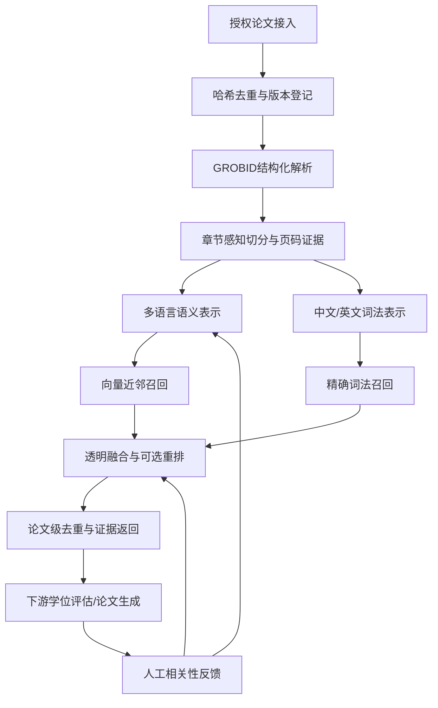

# 技术路线图与创新点

## 路线图

## 面向展示的创新表达

1. **跨语言语义桥**：中文学位论文和英文论文进入统一语义空间，允许中文主题检索英文方法论文，也允许英文问题检索中文研究。
2. **双信号协同**：语义相似度负责“意思接近”，词法检索负责“术语准确”；两者融合后对 DOI、模型名、数据集名、学科专名更稳健。
3. **结构化证据链**：检索结果不止是标题或摘要，而是可追踪到版本、章节和页码的证据片段，适合下游评估与引用生成。
4. **可演进的质量闭环**：先用可解释的召回与 RRF 稳定上线，再用人工标注训练或替换 reranker，避免一开始把不可控的大模型放入关键路径。
5. **规模化处理解耦**：论文接入、解析、嵌入和检索服务解耦；任务可重试、可观测，模型升级可按版本并行迁移。

图片素材见 `docs/assets/technical-innovation.png`。图片刻意使用抽象视觉隐去数据库、模型名和参数，适合技术方案介绍页。

